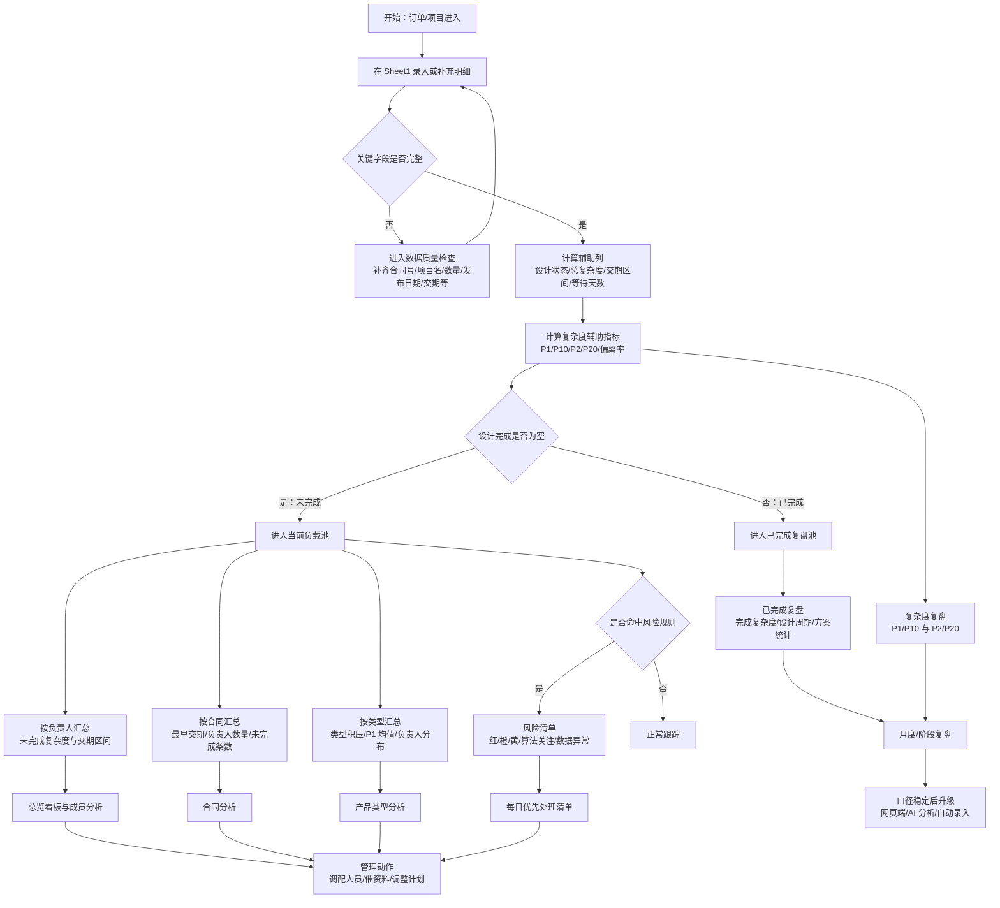

# 订单项目 Excel 分析与看板需求梳理

整理日期：2026-06-18  
角色视角：产品经理  
源文件：`订单项目Excel分析方案.docx`、`项目统计2026.xlsm`

## 1. 需求一句话

在不破坏现有 Excel 手工录入习惯的前提下，基于 `Sheet1` 订单/项目明细，补齐稳定的数据口径、辅助计算列、透视统计、成员负载看板、风险清单、合同汇总和复杂度复盘，让管理者每天能快速回答：

1. 谁当前未完成负载最高？
2. 谁近期交期压力最大？
3. 哪些项目今天必须优先处理？
4. 复杂度算法如何保留，并为后续复盘、网页系统、AI 分析和自动录入打基础？

## 2. 当前 Excel 结构理解

| 工作表 | 当前定位 | 产品建议 |
| --- | --- | --- |
| Sheet1 | 主明细表，包含类型、合同、项目、型号、数量、发布日期、设计完成、交期、负责人、预计、方案、备注等字段 | 保留为核心录入表，只新增辅助计算列，不随意删除原字段 |
| Sheet2 | 类型、类型细化、负责人、方案、备注、销售等基础字典 | 作为下拉选项和数据规范来源 |
| Sheet3 | 零散辅助/试算区域，含少量 `SUMIF` 公式 | 暂不作为第一版核心页面，后续确认是否沉淀为正式字典或计算区 |
| Sheet4 | 现有成员/类型统计结果 | 作为第一版统计看板参考，可重构为更清晰的透视表/看板页 |

## 3. 当前数据概况

以 `项目统计2026.xlsm` 的 `Sheet1` 为准，按 2026-06-18 作为当前日期读取：

| 指标 | 数值 |
| --- | ---: |
| 有效明细总数 | 110 |
| 已完成明细 | 59 |
| 未完成明细 | 51 |
| 全部预计复杂度合计 | 125.6 |
| 未完成预计复杂度合计 | 117.4 |
| 已超期未完成 | 0 条 / 0 |
| 7 天内到期未完成 | 3 条 / 4.0 |
| 8-14 天到期未完成 | 4 条 / 11.0 |
| 15 天以上未完成 | 41 条 / 87.4 |
| 交期缺失未完成 | 3 条 / 15.0 |

未完成复杂度按负责人汇总：

| 负责人 | 未完成条数 | 未完成预计复杂度 |
| --- | ---: | ---: |
| 王玉倩 | 16 | 29.5 |
| 郁焘 | 8 | 29.4 |
| 李鹏飞 | 9 | 25.0 |
| 张晓颖 | 12 | 19.7 |
| 沈志平 | 4 | 9.0 |
| N/A | 2 | 4.8 |

未完成复杂度按类型汇总：

| 类型 | 未完成条数 | 未完成预计复杂度 |
| --- | ---: | ---: |
| 机组 | 24 | 62.9 |
| 除沙机 | 11 | 23.5 |
| 波活门 | 1 | 12.0 |
| 箱体 | 5 | 8.0 |
| 双向HDB | 6 | 7.8 |
| KC-焊 | 1 | 1.7 |
| KC | 3 | 1.5 |

数据质量现状：

| 字段 | 缺失数量 | 影响 |
| --- | ---: | --- |
| 合同号 | 6 | 影响合同级汇总 |
| 项目名称 | 6 | 影响项目追踪和 AI 摘要 |
| 数量 | 2 | 影响 P1 在型号无法解析时的计算 |
| 发布日期 | 1 | 影响等待天数和周期统计 |
| 交期 | 1 | 影响风险判断 |
| 类型、负责人、预计 | 0 | 核心统计基础相对可用 |

## 4. 第一版范围

第一版目标是把 Excel 现有数据变成稳定、可解释、可刷新、可扩展的管理看板。范围如下：

| 模块 | 是否纳入第一版 | 说明 |
| --- | --- | --- |
| Sheet1 明细录入 | 纳入 | 保留原录入习惯，新增辅助列 |
| 成员负载看板 | 纳入 | 按负责人统计未完成复杂度和交期区间 |
| 风险清单 | 纳入 | 聚焦超期、7 天内、等待过久、字段异常 |
| 合同级汇总 | 纳入 | 同合同下多明细、多负责人、最早交期聚合 |
| 产品类型分析 | 纳入 | 看类型积压、已完成/未完成、P1 均值 |
| 已完成复盘 | 纳入 | 看完成数量、复杂度、设计周期 |
| P1/P2 复杂度算法 | 保留但不压到主看板 | 先放辅助列和复盘页 |
| 网页端、AI、自动录入 | 暂不纳入第一版 | 等 Excel 口径稳定后推进 |
| 自动排产、绩效结论、权限体系 | 暂不纳入 | 避免第一版过重 |

## 5. 字段与辅助列设计

### 5.1 原始字段保留

`Sheet1` 现有字段建议全部保留，不随意删除：

序号、类型、类型细化、合同号、项目名称、型号、数量、发布日期、分配日期、设计完成、交期、负责人、预计、方案、销售、常用备注、额外备注。

### 5.2 建议新增辅助列

| 辅助列 | 计算/填写口径 | 用途 |
| --- | --- | --- |
| 设计状态 | `设计完成` 为空 = 未完成；非空 = 已完成 | 区分当前负载和复盘 |
| 总复杂度 | `预计`，空值按 0 处理但进入数据质量问题 | 第一版主指标 |
| 交期区间 | 已超期、7 天内、8-14 天、15 天以上、交期缺失 | 成员堆叠图和风险判断 |
| 等待天数 | 当前日期 - 发布日期 | 识别长期未关闭 |
| 设计周期 | 设计完成 - 发布日期 | 已完成复盘 |
| 分配后周期 | 设计完成 - 分配日期；分配日期缺失时暂不作为强指标 | 成员处理周期分析 |
| 型号解析数量 x | 从型号中解析形如 `*x*` 的有效自然整数；无则为空 | P1 计算 |
| 技术复杂度 P1 | 有 x 时 `预计 / x`，否则 `预计 / 数量` | 技术难度分析 |
| 类型基准 P10 | 同类型 P1 平均值 | 同类型难度基准 |
| 数量复杂度 P2 | `预计` | 数量级压力 |
| 舒适度基准 P20 | 默认 3 | 持续负载压力参考 |
| P1 偏离率 | `(P1 - P10) / P10` | 技术难度偏高标记 |
| P2 偏离率 | `(P2 - P20) / P20` | 负载压力标记 |
| 风险等级 | 按交期、复杂度、等待天数、字段质量综合判断 | 风险清单 |
| 数据质量问题 | 关键字段缺失时输出问题标签 | 修数入口 |

## 6. 指标口径

| 指标 | 口径 | 是否作为第一版主看板指标 |
| --- | --- | --- |
| 总复杂度 | `预计` | 是 |
| 未完成复杂度 | 设计完成为空的总复杂度求和 | 是 |
| 成员负载 | 按负责人汇总未完成复杂度 | 是 |
| 超期复杂度 | 未完成且交期小于当前日期 | 是 |
| 7 天内复杂度 | 未完成且交期在当前日期至当前日期 + 7 天 | 是 |
| 8-14 天复杂度 | 未完成且交期在当前日期 + 8 至 + 14 天 | 是 |
| 15 天以上复杂度 | 未完成且交期在当前日期 + 15 天以后 | 是 |
| 已完成复杂度 | 设计完成不为空的总复杂度求和 | 复盘页展示 |
| P1/P10 | 技术复杂度与类型基准 | 复盘页展示 |
| P2/P20 | 数量复杂度与舒适度基准 | 复盘页展示 |

注意：复杂度算法结果只作为管理分析参考，不直接等同于个人绩效。

## 7. 页面/看板需求

| 页面 | 核心内容 | 主要使用场景 |
| --- | --- | --- |
| 录入表 | `Sheet1` 原字段 + 辅助列 | 日常录入、刷新统计 |
| 总览看板 | 未完成总复杂度、未完成条数、超期、7 天内、14 天内、数据异常数 | 每天快速判断整体压力 |
| 成员分析 | 按负责人堆叠显示已超期、7 天内、8-14 天、15 天以上复杂度；附成员明细 | 判断谁负载高、谁近期紧 |
| 风险清单 | 超期、7 天内、等待超过 21 天、字段异常、P1/P2 异常 | 每日优先处理 |
| 合同分析 | 合同号、项目名称、总复杂度、最早交期、未完成条数、负责人数量、类型数量 | 防止同合同被拆散 |
| 产品类型分析 | 类型/类型细化、未完成复杂度、已完成复杂度、P1 均值、负责人分布 | 看产品线积压和难度 |
| 复杂度复盘 | P1/P10、P2/P20，按类型、成员、状态筛选 | 保留算法价值 |
| 已完成复盘 | 成员、类型、方案维度的完成数量、完成复杂度、平均周期 | 复盘产出和效率 |
| 数据质量检查 | 合同号、项目名、数量、发布日期、交期等异常明细 | 修正录入口径 |

## 8. 风险判断规则

| 风险等级 | 判断条件 | 处理建议 |
| --- | --- | --- |
| 红色 | 未完成且交期已过 | 立即确认原因，必要时调整人员、资料或交期 |
| 红色 | 未完成且 7 天内到期，且总复杂度较高 | 纳入每日重点跟踪 |
| 橙色 | 未完成且 7 天内到期 | 每日检查进展 |
| 黄色 | 未完成且 8-14 天内到期 | 纳入周计划 |
| 黄色 | 发布超过 21 天仍未完成 | 检查是否卡在客户确认、资料缺失或技术难点 |
| 算法关注 | P1 明显高于 P10，或 P2 明显高于 P20 | 必要时安排经验人员协助 |
| 数据异常 | 关键字段缺失、预计为空、交期为空或负责人为空 | 先补数据，再参与看板判断 |
| 绿色 | 已完成，或未完成但交期在 15 天以上且复杂度较低 | 正常跟踪 |

## 9. 业务流程图

## 10. 实施优先级

| 优先级 | 任务 | 验收标准 |
| --- | --- | --- |
| P0 | 新增设计状态、交期区间、总复杂度辅助列 | 每条明细能自动得到状态、区间和总复杂度 |
| P0 | 建立成员复杂度堆叠透视表和图表 | 能一眼看出成员总负载和近期压力 |
| P0 | 保留并补齐 P1/P2 复杂度辅助列 | P1、P10、P2、P20 有明确公式，可用于复盘 |
| P1 | 建立风险清单 | 超期、7 天内、等待过久、数据异常可单独筛出 |
| P1 | 建立合同级汇总 | 同一合同下的多明细、多负责人、最早交期能聚合 |
| P2 | 建立产品类型和已完成复盘页 | 可查看类型积压、已完成复杂度、平均设计周期、平均 P1 |
| P2 | 建立数据质量检查页 | 关键字段缺失能被列出并修正 |
| P3 | 接入网页端、AI 和自动录入 | Excel 口径稳定后再推进 |

## 11. 暂不随意删除的内容

以下内容建议保留，避免后续口径断层：

1. `Sheet1` 原始字段全部保留。
2. `预计` 字段保留为第一版总复杂度来源。
3. P1/P10、P2/P20 算法保留为辅助列和复盘页，不从需求中删除。
4. `Sheet2` 字典保留，并逐步规范为下拉来源。
5. `Sheet4` 当前统计结果保留为参考，重构时建议另建新版看板或复制后改造。
6. `Sheet3` 暂不直接删除，先确认其试算逻辑是否仍有业务价值。

## 12. 待甲方确认事项

| 问题 | 建议默认值 | 需要确认原因 |
| --- | --- | --- |
| “总复杂度较高”的阈值 | 暂定 `总复杂度 >= 3` | 用于 7 天内高风险红色判断 |
| 等待过久阈值 | 暂定发布超过 21 天未完成 | 文档已有方向，但需确认是否符合业务节奏 |
| 分配日期缺失时的口径 | 暂不用于强考核，只用于后续补录 | 当前分配日期不完整，直接计算会误导 |
| P10 基准样本范围 | 同类型全部明细，后续可切已完成样本 | 不同样本范围会影响 P1 偏离率 |
| P110% / P220% 展示方式 | 先放复盘页，不放主看板 | 避免第一版过重，但保留算法 |
| N/A 负责人 | 保留但进入数据质量/待分配关注 | 当前已有未完成复杂度 4.8 |
| 是否需要自动刷新按钮 | 第一版可手动刷新透视表，后续做一键刷新 | 取决于使用频率和宏安全策略 |

## 13. 产品结论

第一版不要重做系统，也不要把 Excel 变成不可维护的复杂工程。正确路径是：

1. 稳住 `Sheet1` 录入口径。
2. 加辅助列，让明细自动产生状态、风险和复杂度指标。
3. 用透视表/图表回答每日管理问题。
4. 把 P1/P10、P2/P20 留在复盘层，既不丢算法，也不压垮日常看板。
5. 等数据质量和使用流程稳定后，再升级到网页端、AI 分析和自动录入。

